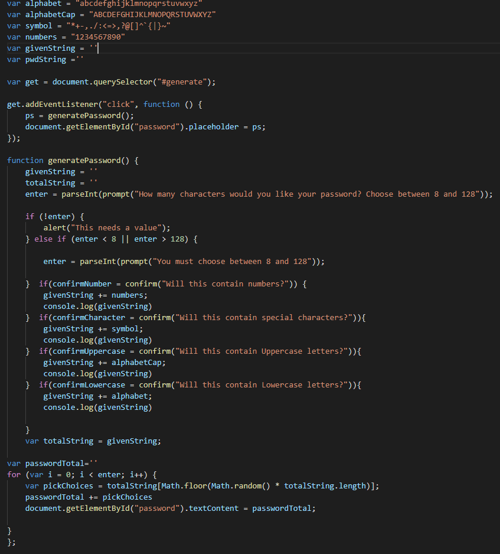

# password-generator
a random password generator

The following JS logic pulls from four existing strings and concatenates them into a single larger string depending on the users choice. The logic then pulls, at random, from this larger string to create the password. I chose this version of the assignemnt because the code was the simplest and most easily understood of the three ways in which I got the generator to work. 

The first and second versions of JS logic I created are in the file 'other logics', they both work when linked up to the HTML file.
These two logics use arrays and either an 'else if' or 'switch' function to choose which arrays to concatenate. I initally wrote the else if function and thought it was too large for such a simple program, making the possibility of later edits or additions harder than necessary. From there I tried to shorten that code by reorganizing the else if statements into a switch. While they both function they are each over sixty lines of code. 

Here is the chosen logic. 

